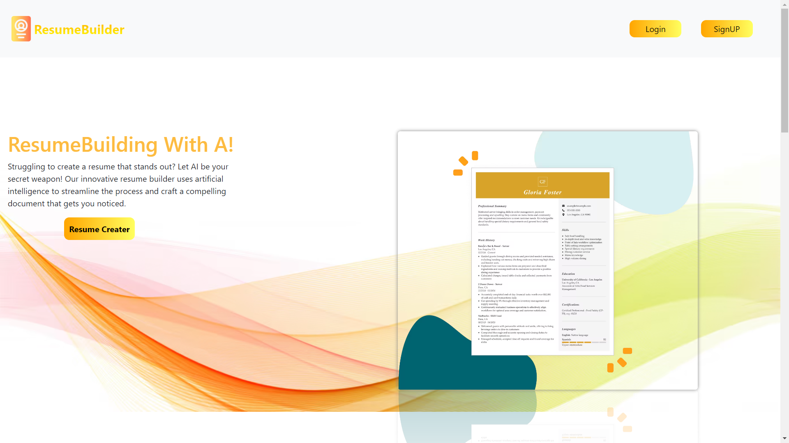
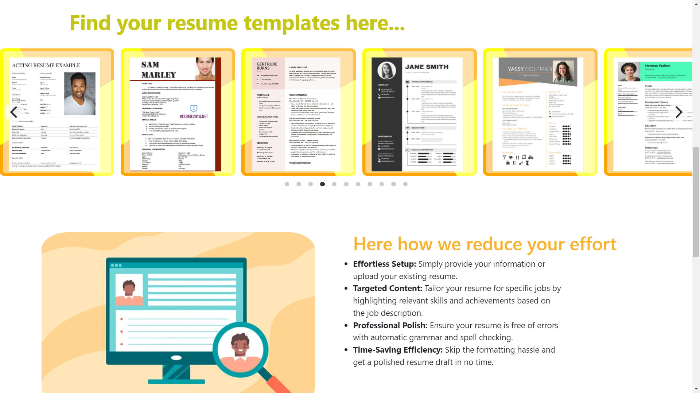
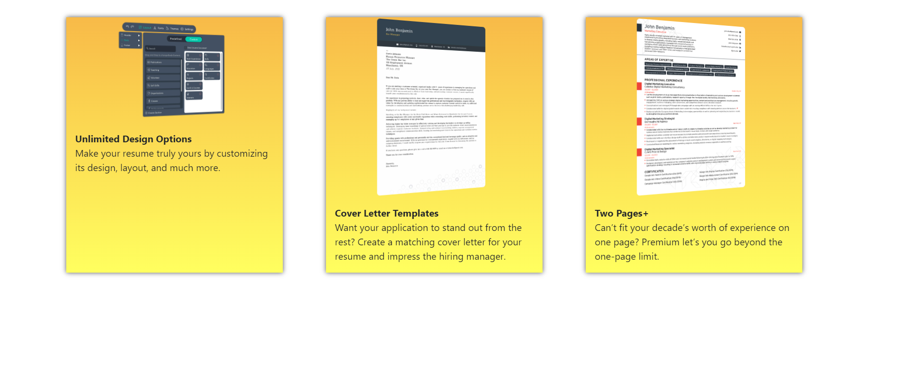
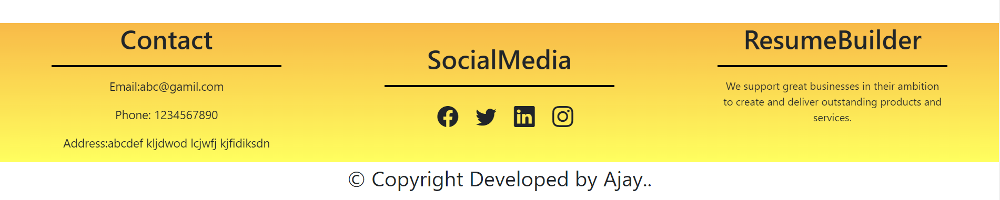
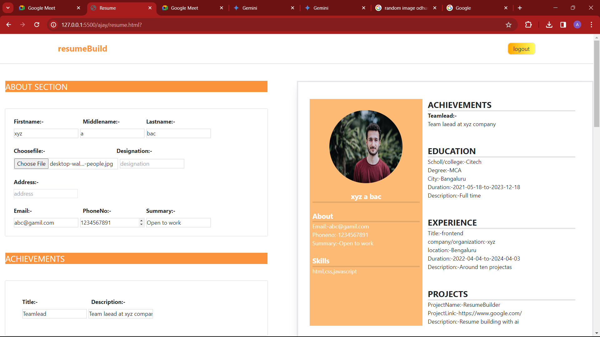
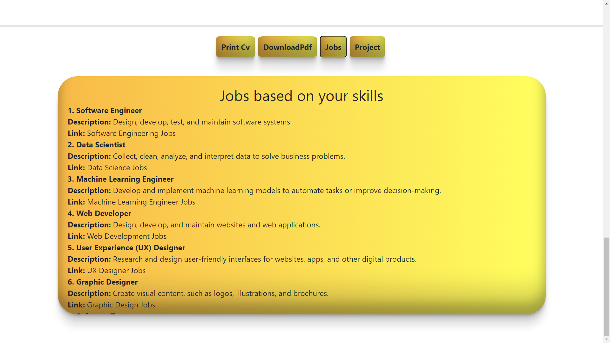
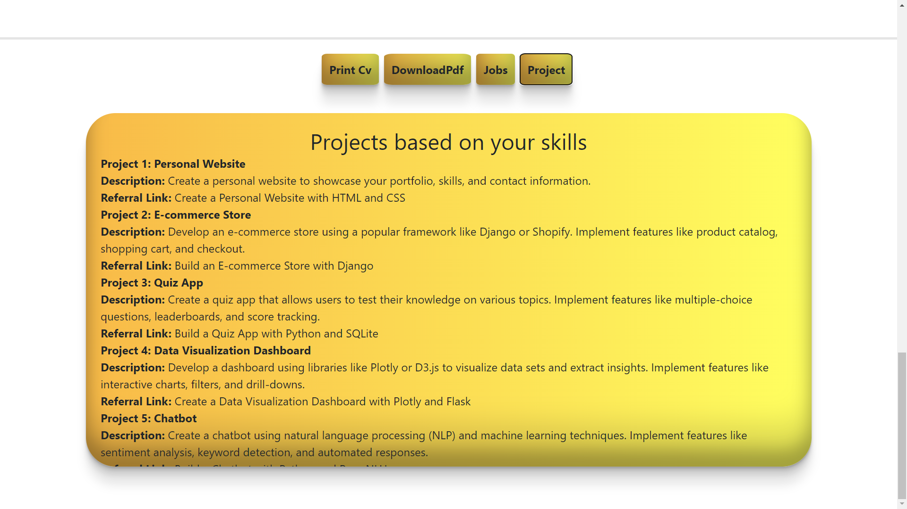

# Interview ready with A!
Hey there! Standing out in today's job market is tough. Let's make it easier! Dive into our AI-powered resume builder and create a stunning read.md resume that highlights your best qualities and lands you the interview.

### Hosted Link
[Resumebuilder](https://kereajay.github.io/gekathonjs/)

### Technologies Used
- HTML (Markup Language)

- CSS (Style Sheet Language)

- JavaScript (Scripting Language)

- AOS Library for animations
- Bootstrap
- TailwindCSS
### Development Stack
- HTML and CSS for structuring and styling web content.

- JavaScript for the dynamic functionality

- AOS library for the animations

- Bootstrap and TailwindCSs for the resposnsive design

### Features To Explore
#### Personalized:-
 Cover Letter Creation: Build an AI feature that generates a cover letter tailored to the chosen job description, drawing relevant skills and experiences from the user's resume.
 #### Template selection:-
 The user can select  a template from  predefined templates or create their own custom  template by using predefine  user input.
 #### Skill Recomendation:-
 Based on user skill they can search for the job recomendation. With the help of Ai.
 #### Project Recomendation:-
 Based on user skill they can search for the projects recomendation. With the help of Ai.
 #### Animations:-
 Using some of the builtin libraries the anmations are added to the website it will increase the user webtime.
 #### Responsive
 The entire page is responsive for the standard resolution.The user can experience the good UI.
 #### Download and print:-
 By clicking on download and print button usre is able to print and downlad there resume. 

 ### Getting Started:
 1. Clone or download the respsitory
 2. Navigate to the index.html file in the root directory and open it.
 3. Open the index.html file in the browser
 4. Now you are on index.html you all can see the Redirect link
 5. That Redirect link will redirect you to our home page or index.html of resume builder UI.
 6. As soon as user visit the home page first usre has to signup
 7.  After signingup it will redirect you to the login page from that the usre can login and it will redirect to the template page
 8. Now user can start building there resume by simply giving the inputvalues.
 9. From this template page the usre can serach for the job and project by clicking on the job and project button
 10. Finally usre can get the job and project recomendation  based on their skills with the help of Ai

 ### ScreenShots
 #### Home page
 
 #### Resume Templates
 
 
  #### Footer
 
  #### Template example
 
  #### Job search with ai
 
  #### Project search with ai
 

 ### Credits
 #### 	[Ajay](https://www.linkedin.com/in/ajay-kere-443119220/)

 #### Mentor
 Thank you so much for your guidance and support throughout this project. I truly appreciate your mentorship.

 #### Gratitude to Our Exceptional Instructors at Geekster:
 [Akhil Sharma](https://www.linkedin.com/in/akhil-sh06/):Thank you for being an exceptional educator. Your dedication, enthusiasm, and ability to make learning engaging have inspired us. I appreciate the positive influence you've had on our course duration.

 [Shobit](https://www.linkedin.com/in/akhil-sh06/):I want to express my sincere gratitude to you as an educator. Your passion for teaching and commitment to student success have made a lasting impact on our educational journey.

